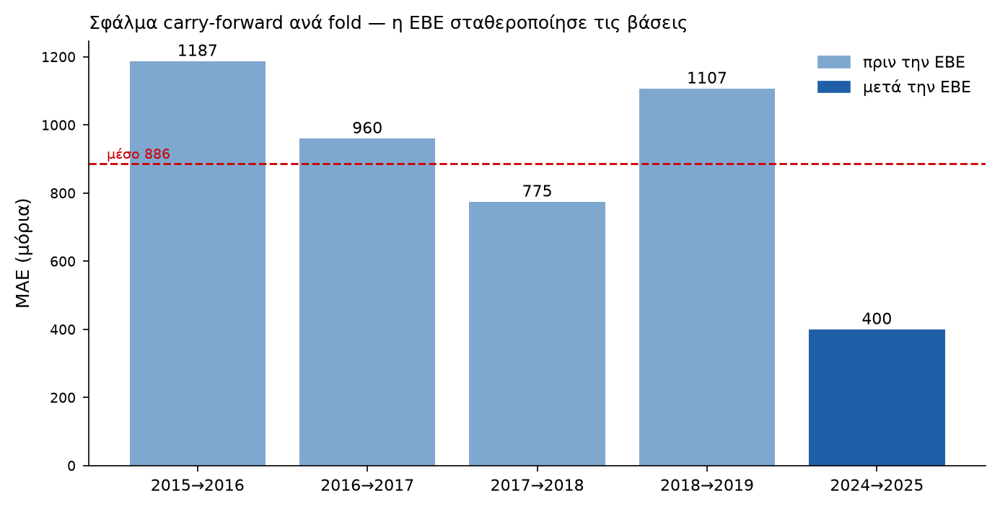
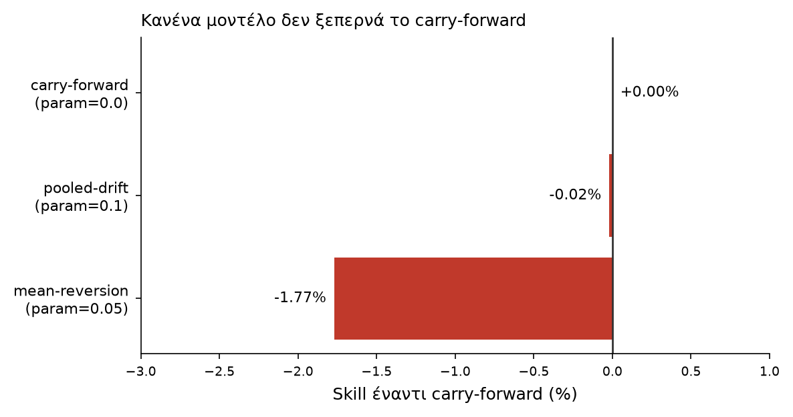
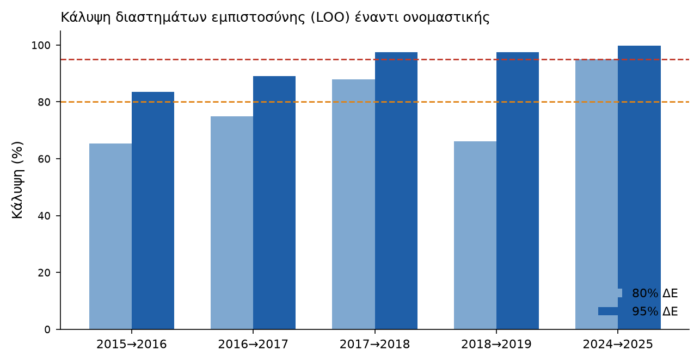

# Backtest Report — Πρόβλεψη βάσεων «Πυξίδα ΑΕΙ»

## Σύνοψη

**Το μοντέλο που παραδίδεται είναι το carry-forward (μεταφορά περσινής βάσης).**
Δοκιμάστηκαν δύο εναλλακτικά μοντέλα ζήτησης (pooled field-drift, mean-reversion
προς τη διάμεσο πεδίου) σε leave-one-fold-out backtest· **κανένα δεν ξεπερνά το
carry-forward**. Σύμφωνα με τον ρητό κανόνα του έργου («ship a model only if it
beats baseline»), δεν παραδίδεται μοντέλο ζήτησης — παραδίδεται το baseline με
**εμπειρικά διαστήματα πρόβλεψης**.

## Περιορισμός δεδομένων

Τα έτη **2020–2023 απουσιάζουν** από τα επίσημα ανοικτά δεδομένα, οπότε το
ζητούμενο παράθυρο 2022–2025 δεν είναι ανακατασκευάσιμο. Το backtest εκτελείται
στα **5 διαθέσιμα διαδοχικά folds**: τέσσερα πριν την ΕΒΕ (2015→2019) και ένα
μετά (2024→2025).

## 1. Σφάλμα carry-forward ανά fold

| Fold      |   N |    MAE |   RMSE |   Bias | Καθεστώς   |
|:----------|----:|-------:|-------:|-------:|:-----------|
| 2015→2016 | 460 | 1187.3 | 1785.9 |  239.9 | pre-ΕΒΕ    |
| 2016→2017 | 460 |  960   | 1607.2 | -118.5 | pre-ΕΒΕ    |
| 2017→2018 | 435 |  774.6 | 1321.3 |  121.5 | pre-ΕΒΕ    |
| 2018→2019 | 355 | 1106.7 | 1460.4 |  926.3 | pre-ΕΒΕ    |
| 2024→2025 | 449 |  399.9 |  652.7 |  -22.9 | post-ΕΒΕ   |

Μέσο MAE = **886 μόρια**. Κρίσιμη παρατήρηση: το **μετά-ΕΒΕ fold
(2024→2025) έχει MAE μόλις 400 μόρια** — λιγότερο από το μισό του μέσου
πριν-ΕΒΕ (1007). Η ΕΒΕ **σταθεροποίησε** τις βάσεις.

## 2. Σύγκριση μοντέλων (skill έναντι baseline)

| Μοντέλο        |   Παράμετρος |   MAE |   Skill % |
|:---------------|-------------:|------:|----------:|
| carry-forward  |         0    | 885.7 |      0    |
| pooled-drift   |         0.1  | 885.9 |     -0.02 |
| mean-reversion |         0.05 | 901.3 |     -1.77 |

Και τα δύο εναλλακτικά μοντέλα έχουν **μη θετικό skill** — το σήμα
drift/mean-reversion δεν είναι αξιοποιήσιμο πέρα από την εμμονή της περσινής τιμής.

## 3. Κάλυψη διαστημάτων πρόβλεψης (leave-one-fold-out)

Τα διαστήματα κατασκευάζονται από τα εμπειρικά quantiles των residuals των
**υπόλοιπων** folds και ελέγχονται στο held-out fold (χωρίς διαρροή).

| Fold      |   N |   Κάλυψη 80% |   Κάλυψη 95% | Καθεστώς   |
|:----------|----:|-------------:|-------------:|:-----------|
| 2015→2016 | 460 |        0.654 |        0.835 | pre-ΕΒΕ    |
| 2016→2017 | 460 |        0.75  |        0.891 | pre-ΕΒΕ    |
| 2017→2018 | 435 |        0.88  |        0.975 | pre-ΕΒΕ    |
| 2018→2019 | 355 |        0.662 |        0.975 | pre-ΕΒΕ    |
| 2024→2025 | 449 |        0.949 |        0.998 | post-ΕΒΕ   |

Μέση κάλυψη: **80% ονομαστικό → 78% εμπειρικό**, **95% → 93%**.
Το μετά-ΕΒΕ fold είναι το καλύτερα βαθμονομημένο (80%→95%, 95%→100%).

## 4. Πρόβλεψη 2026

Carry-forward από το 2025 με **εμπειρικά PI από τα residuals του μετά-ΕΒΕ
καθεστώτος μόνο** (εύρος 80% ≈ ±600 μόρια, έναντι ±1.309 με όλα τα folds).
Παράδειγμα — Ιατρική ΕΚΠΑ (295): point **18.775**, 80% ΔΕ **[18.087, 19.287]**,
95% ΔΕ **[17.369, 20.173]**. Πλήρης πίνακας: `forecast_2026.csv` (453 τμήματα),
επίσης στον πίνακα `prediction` (endpoint `/predictions/{code}`, feature flag).

## 5. Γιατί δεν εφαρμόζεται σκληρό clipping ΕΒΕ στα μόρια

Το κατώφλι ΕΒΕ ορίζεται στην κλίμακα **μέσου όρου πεδίου (/20)×1000**, όχι στην
κλίμακα **μορίων (/20000)**· ένα κυριολεκτικό `max(ΕΒΕ, ζήτηση)` σε μόρια συγκρίνει
ασύμβατες μονάδες και **επιδείνωσε** το fold 2024→2025. Αντ' αυτού το προφίλ κάθε
τμήματος εμφανίζει τον **συντελεστή ΕΒΕ**, ως επισήμανση όχι ως αλγοριθμικό clip.
