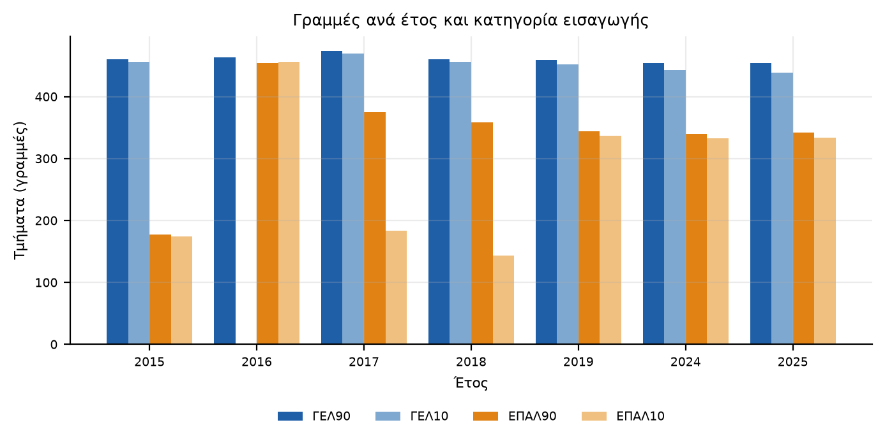
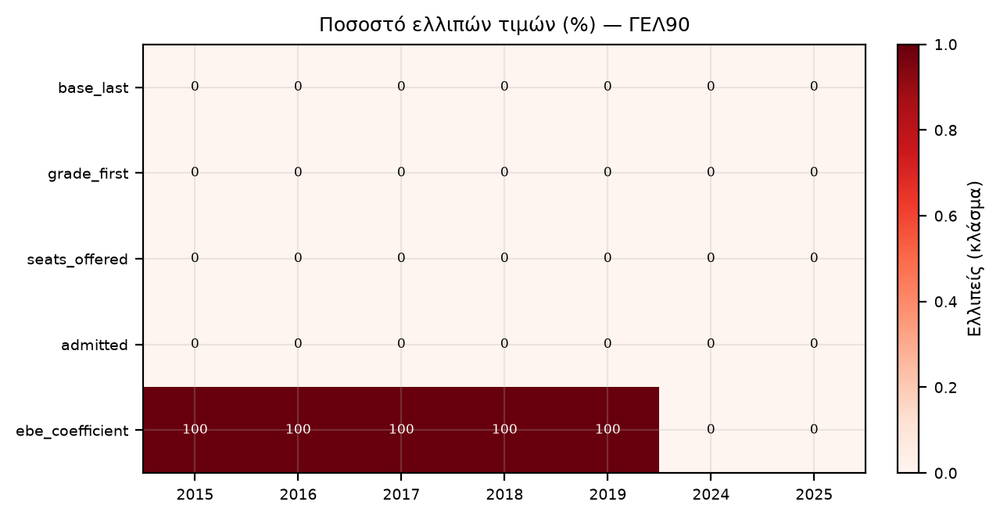
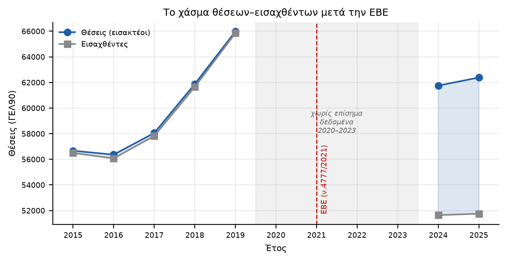

# QA Report — «Πυξίδα ΑΕΙ» Phase 0

**Gate status: ✅ PASS**

## 1. Έλεγχοι λογικής (5 sanity checks)

| # | Έλεγχος | Αποτέλεσμα | Λεπτομέρεια |
|---|---|---|---|
| 1 | Ιατρική ΕΚΠΑ βάση εντός εύρους 18000–19500 | ✅ | 18724–19143 μόρια, 7/7 έτη εντός εύρους |
| 2 | Σύνολο θέσεων ΓΕΛ90 συμβατό με εισακτέοι αναφοράς | ✅ | 2024: ΓΕΛ90=61,754.0 vs total εισακτέοι~68,851; 2025: ΓΕΛ90=62,381.0 vs total εισακτέοι~68,788 |
| 3 | Κενές θέσεις ΓΕΛ90 2025 τάξης ~10.636 (αναφορά) | ✅ | 2024=10,112, 2025=10,628 κενές (αναφορά: 10.636 ΓΕΛ 2025) |
| 4 | Λογική ακεραιότητα (admitted<=θέσεις+ισοβαθμίες, 0<=fill_rate<=1) | ✅ | 0 γραμμές-σφάλματα· 7 νόμιμες υπερβάσεις +1 από ισοβαθμία |
| 5 | Συντελεστές ΕΒΕ εντός [0.80,1.20] & απόντες προ-2021 | ✅ | 0 εκτός εύρους, 0 προ-2021 με ΕΒΕ |

## 2. Γραμμές ανά έτος × κατηγορία

|   year |   ΓΕΛ10 |   ΓΕΛ90 |   ΕΠΑΛ10 |   ΕΠΑΛ90 |
|-------:|--------:|--------:|---------:|---------:|
|   2015 |     456 |     460 |      174 |      177 |
|   2016 |       0 |     463 |      456 |      454 |
|   2017 |     470 |     474 |      183 |      375 |
|   2018 |     456 |     460 |      143 |      358 |
|   2019 |     452 |     459 |      337 |      344 |
|   2024 |     443 |     454 |      333 |      340 |
|   2025 |     439 |     454 |      334 |      342 |

## 3. Προφίλ ελλιπών τιμών (ΓΕΛ90)

|   year |   base_last |   grade_first |   seats_offered |   admitted |   ebe_coefficient |
|-------:|------------:|--------------:|----------------:|-----------:|------------------:|
|   2015 |         0   |           0   |               0 |          0 |               100 |
|   2016 |         0   |           0   |               0 |          0 |               100 |
|   2017 |         0   |           0   |               0 |          0 |               100 |
|   2018 |         0   |           0   |               0 |          0 |               100 |
|   2019 |         0   |           0   |               0 |          0 |               100 |
|   2024 |         0   |           0   |               0 |          0 |                 0 |
|   2025 |         0.2 |           0.2 |               0 |          0 |                 0 |

## 4. Χάσμα θέσεων–εισαχθέντων (αφήγηση ΕΒΕ)

## 5. Crosswalk

- Aliases (renames/ΤΕΙ-absorption): **38**
- Unmatched departments logged: **147** (βλ. πίνακα `unmatched_dept`)

## 6. Κενά δεδομένων (γνωστά)

- Έτη **2020–2023**: απουσιάζουν από τα επίσημα open data του data.gov.gr· ο mirror aeitei.gr απορρίπτει αυτοματοποιημένους πελάτες σε αυτό το περιβάλλον. Καλύπτονται συγκεντρωτικά από την έκθεση.
- **2016 ΓΕΛ10**: το αρχείο RAR του 2016 δεν διαχώριζε ΓΕΛ10 (0 γραμμές).
